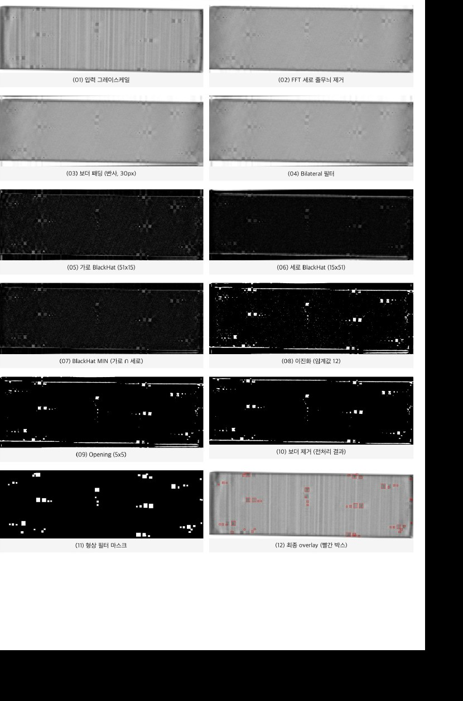
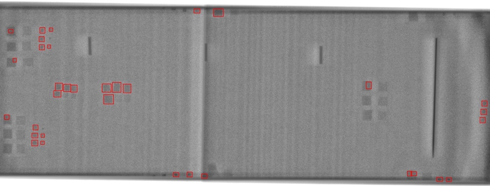
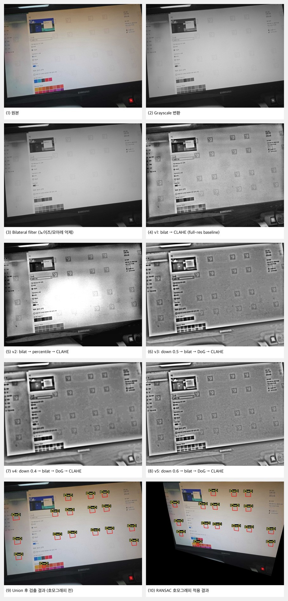

# Classical Vision-Based Detection

Classical computer vision assignment with two detection tasks: EV battery X-ray foreign object detection and ArUco marker detection with perspective correction. The project was implemented without deep learning, using OpenCV and NumPy only.

## Overview

This repository contains two pipelines:

- **EV battery X-ray foreign object detection**: detects small square-like foreign objects in X-ray images under stripe noise, compression artifacts, and resized inputs.
- **ArUco marker detection**: detects low-contrast, alpha-blended ArUco markers from monitor photos and estimates perspective-corrected views.

## EV Battery X-ray Defect Detection

The EV pipeline is designed around the structure of the input data: target defects are dark, square-like blobs, while major false positives are long vertical components and stripe patterns. The final method uses frequency-domain stripe suppression, edge-preserving smoothing, oriented morphological filtering, and shape-based contour filtering.





### Pipeline

1. Convert the input X-ray image to grayscale.
2. Remove vertical stripe noise with a 2D FFT mask while preserving the DC component.
3. Add reflected border padding to reduce weak morphology responses near image boundaries.
4. Apply bilateral filtering to suppress flat-region noise while preserving defect edges.
5. Compute horizontal and vertical BlackHat responses with asymmetric kernels.
6. Take the element-wise minimum of the two BlackHat responses to keep square-like dark regions and reject one-directional structures.
7. Threshold the response and apply morphological opening.
8. Extract contours and filter them using area, width, height, aspect ratio, circularity, rotated-box aspect ratio, and moment-based elongation.
9. Draw bounding boxes on the original image and report center coordinates, pixel area, and mean brightness for each detected object.

### Key Ideas

- **FFT stripe removal** directly suppresses periodic vertical stripe artifacts before morphology.
- **Asymmetric BlackHat MIN** is the main false-positive rejection step. Square-like defects respond in both horizontal and vertical kernels, while long stripe or bar-like structures respond strongly in only one direction.
- **Shape filtering** uses contour features to keep compact regions and remove elongated structures.

## ArUco Marker Detection

The ArUco pipeline targets low-contrast markers blended into monitor images. Raw `ArucoDetector` often misses these markers because of moire patterns, glare, text interference, and weak marker contrast. The final pipeline combines multiple preprocessing branches, rejected-candidate recovery, ID filtering, and perspective correction.



### Pipeline

1. Convert BGR input to grayscale.
2. Apply multiple preprocessing variants:
   - Bilateral filtering + CLAHE
   - Bilateral filtering + percentile stretching + CLAHE
   - Downscale + bilateral filtering + DoG + CLAHE at multiple scales
3. Run `cv2.aruco.ArucoDetector` on each variant.
4. Recover rejected quadrilateral candidates by warping each candidate, extracting a 4x4 bit pattern, and comparing it with the ID 0 reference marker using Hamming distance.
5. Filter candidates by marker size and ID.
6. Merge duplicate detections across preprocessing branches.
7. Estimate perspective correction and save overlay/result images.

### Key Ideas

- **Multi-variant preprocessing** improves robustness across weak contrast, glare, and moire patterns.
- **Cell-scale DoG filtering** emphasizes ArUco cell structures while suppressing both small pixel noise and large background variation.
- **Rejected candidate recovery** manually rechecks quadrilateral candidates that were found geometrically but failed internal bit matching.

## Results Summary

| Task | Input | Output |
|---|---|---|
| EV defect detection | 6 EV battery X-ray images | Preprocessed binary maps, segmentation overlays, defect coordinate/area/brightness tables |
| ArUco marker detection | 5 monitor photos | Marker overlays, perspective-corrected results, detection summaries |

The EV detector was evaluated against manually derived reference boxes from the provided ROI image. The report records an overall F1 score of **0.72** for the final EV pipeline.

For ArUco detection, the final report records successful marker detection across all five images, including difficult low-contrast and moire-heavy cases.

## Repository Structure

```text
.
├── aruco/
│   └── aruco_detection.py
├── ev/
│   └── ev_defect_detection.py
├── assets/
│   ├── aruco_pipeline_test2.jpg
│   ├── aruco_pipeline_test5.jpg
│   ├── ev_pipeline_ev1.jpg
│   ├── ev_overlay_ev1.jpg
│   ├── ev_pipeline_ev2.jpg
│   └── ev_overlay_ev2.jpg
├── requirements.txt
└── README.md
```

## Running

Install dependencies:

```bash
pip install -r requirements.txt
```

Run EV defect detection by placing the EV images in `ev/` and executing:

```bash
python ev/ev_defect_detection.py
```

Expected EV image names:

```text
EV1.jpg
EV2.jpg
EV3.jpg
EV1_Q20.jpg
EV2_R50_Q70.jpg
EV3_R65_Q50.jpg
```

Run ArUco detection by placing the ArUco images in `aruco/` and executing:

```bash
python aruco/aruco_detection.py
```

Expected ArUco image names:

```text
Aruco_test1.jpg
Aruco_test2.jpg
Aruco_test3.jpg
Aruco_test4.jpg
Aruco_test5.jpg
```

Generated outputs are written under each task's `Result` directory.
